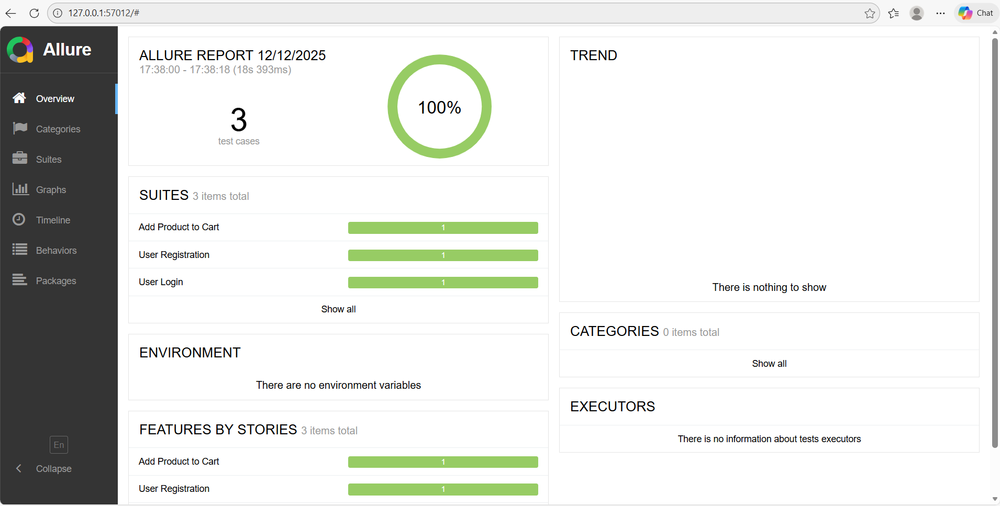
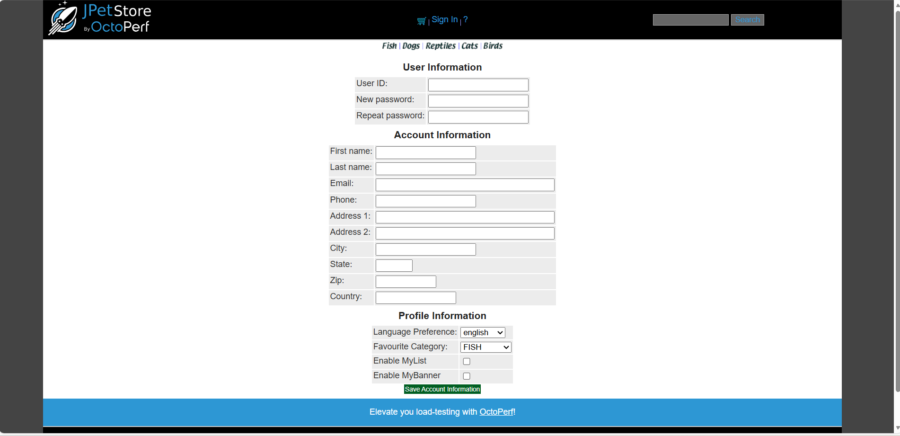
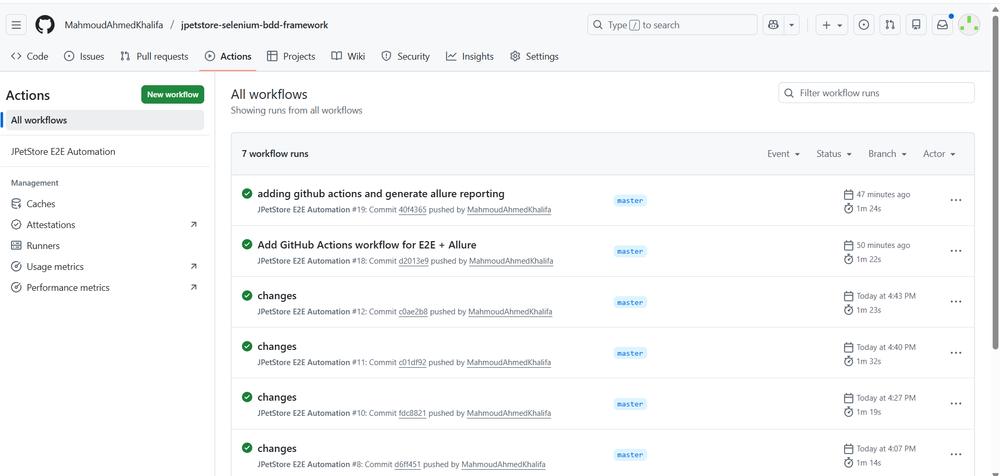

JPetStore Demo — Automation Project (Selenium + Java + BDD)
 
## 🚀 Overview

This repository contains an automated testing project for the JPetStore Demo application. The project is built using Selenium WebDriver (Java) with Cucumber BDD, following the Page Object Model (POM) design pattern. The objective is to create a clean, maintainable, and fully dynamic automation framework without any hard‑coded test data or locators.

## 📌 Automated Scenarios

- **User Registration** — Create a new user using fully dynamic test data
- **Sign In** — Log in using the same dynamically created credentials
- **Add to Cart** — Select category → product → item dynamically

## 🔧 Key Framework Features

✔ 100% Dynamic — No Hard‑Coding

Categories, products, and items are selected dynamically.

The user specifies the name, and the framework automatically generates the correct locator using templates.

✔ Dynamic Test Data (testdata.json)

All test data (register and login info) are stored in JSON.

✔ Fully Configurable

A config.properties file allows modification of:

Application URL

Browser (Chrome, Firefox, etc.)

Explicit wait durations

Headless mode

No need to modify code — just update config.

✔ Cucumber Hooks

@Before initializes driver, config, and dynamic test data.

@After closes the browser and can be extended to capture screenshots.

✔ POM (Page Object Model)

Each page has its own class with reusable actions and dynamic element locators.

Step Definitions remain clean and focused on behavior.

✔ Allure Reporting Integration

Generates a full HTML Allure Report.

Can be opened locally using:

allure serve allure-results

✔ GitHub Actions CI/CD

Pipeline supports manual runs (workflow_dispatch) and scheduled runs (cron).

Allure report is uploaded as an artifact.

After downloading and extracting, run:

allure open allure-report

## 🧱 Project Structure
.
├── .github
│   └── workflows
│       └── my-workflow.yml
│
├── pom.xml
│
└── src
├── main
│   ├── java
│   │   ├── core
│   │   │   ├── DriverFactory.java
│   │   │   └── TestBase.java
│   │   │
│   │   ├── pages
│   │   │   ├── BasePage.java
│   │   │   ├── HomePage.java
│   │   │   ├── LandingPage.java
│   │   │   ├── RegistrationPage.java
│   │   │   └── SignInPage.java
│   │   │
│   │   └── utils
│   │       ├── ConfigReader.java
│   │       ├── UserDataHelper.java
│   │       └── WaitUtils.java
│   │
│   └── resources
│       ├── config
│       │   └── config.properties
│       │
│       └── testData
│           └── testdata.json
│
└── test
├── java
│   ├── hooks
│   │   └── Hooks.java
│   │
│   ├── runners
│   │   └── TestRunner.java
│   │
│   └── stepdefinitions
│       ├── CartSteps.java
│       ├── CommonSteps.java
│       ├── LoginSteps.java
│       └── RegisterSteps.java
│
└── resources
└── features
├── add_to_cart.feature
├── createAccount.feature
└── login.feature

## ▶️ How to Run Locally

1. Clone the repository
2. Run the tests using 'mvn clean test'
3. Generate and view Allure Report using 'allure serve allure-results'

## 📈 Future Enhancements

1. Parallel Execution using TestNG or Selenium Grid.

2. Screenshot Attachments in Allure for each failure or major step.

3. Logging (Log4j2) and attaching logs to Allure.

4. Automatic Report Delivery to Slack or Email.

5. Dockerized Execution (Selenium Grid + containers).

6. Advanced Retry Analyzer for flaky test management.
